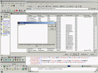



## VarHelper

### Description

This is simply addin wich enumerate all code for variables.

It Make raport (deadh variables, not properly set, etc.) to screen and to XML.
 
### More Info
 
Some project in VB

I not fished it yet. Now I don't have to much time for it (money...). If some one want sell it (or pay for it) I can finish it and make it better.

Report of used variables (screen, xml)

             |
---                |---
**Submitted On**   |2001-04-03 11:52:46
**By**             |[Mateusz Kierepka](https://github.com/Planet-Source-Code/PSCIndex/blob/master/ByAuthor/mateusz-kierepka.md)
**Level**          |Intermediate
**User Rating**    |4.8 (19 globes from 4 users)
**Compatibility**  |VB 5\.0, VB 6\.0
**Category**       |[VB function enhancement](https://github.com/Planet-Source-Code/PSCIndex/blob/master/ByCategory/vb-function-enhancement__1-25.md)
**World**          |[Visual Basic](https://github.com/Planet-Source-Code/PSCIndex/blob/master/ByWorld/visual-basic.md)
**Archive File**   |[VarHelper17854432001\.zip](https://github.com/Planet-Source-Code/mateusz-kierepka-varhelper__1-22107/archive/master.zip)

